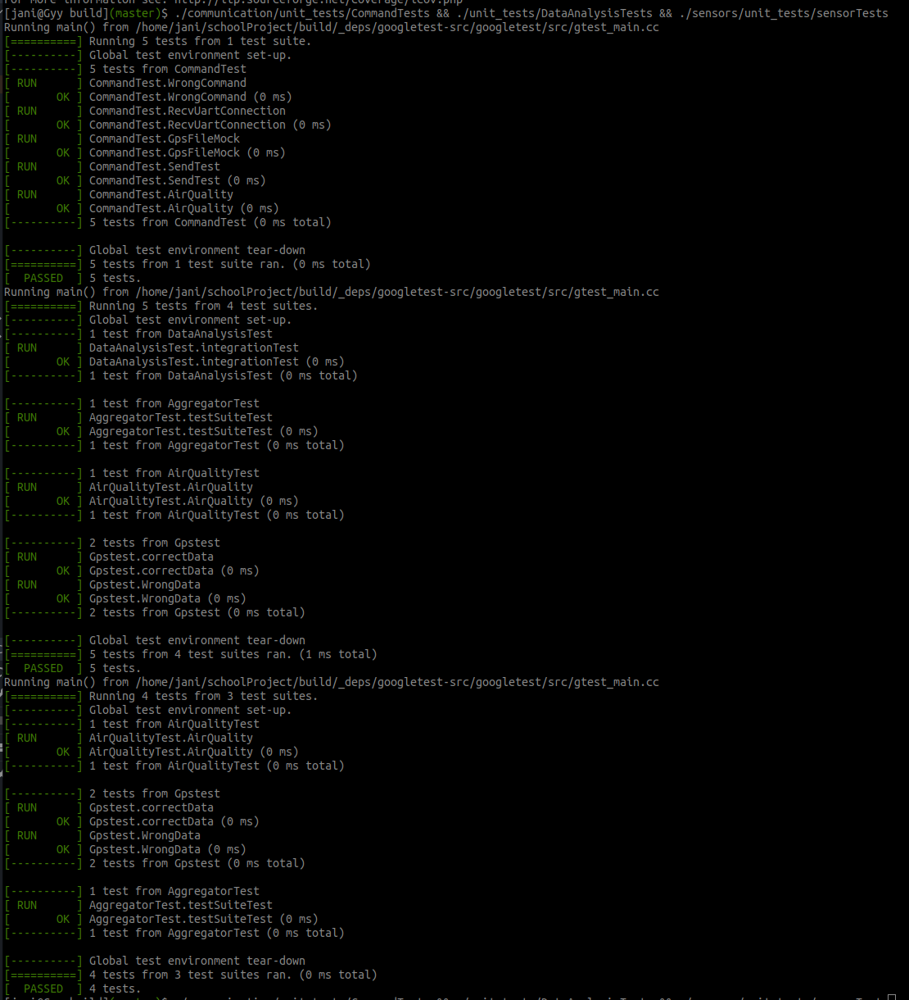

# School Project
Project have two sensor one for Air quality and other for gps coordinates.
gps coordinates uses uart to communication and Air quality sensor is random sine wave data.
Those both sensor data needed to combine and make min/max/avg analysis.

All code needed to be tested using Google unit testing framework and after adaptation to Nucleo board need functionality
test using Robot framework.

For debug functionality need set also uart communication and send data out of system that way

## Building and testing
* To build you need Linux host machine, cmake, gcc etc. Build process is simple
* Go source directory root and write command `mkdir build && cd build`
* `cmake -DUT_TEST=1 ../`
* `cmake --build .`
* To find all unit test binaries use `find . -name *"Tests"`
* run all tests `./communication/unit_tests/CommandTests && ./unit_tests/DataAnalysisTests && ./sensors/unit_tests/sensorTests`

